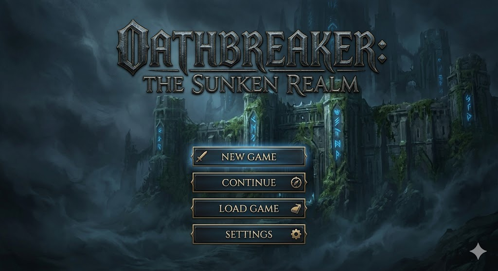
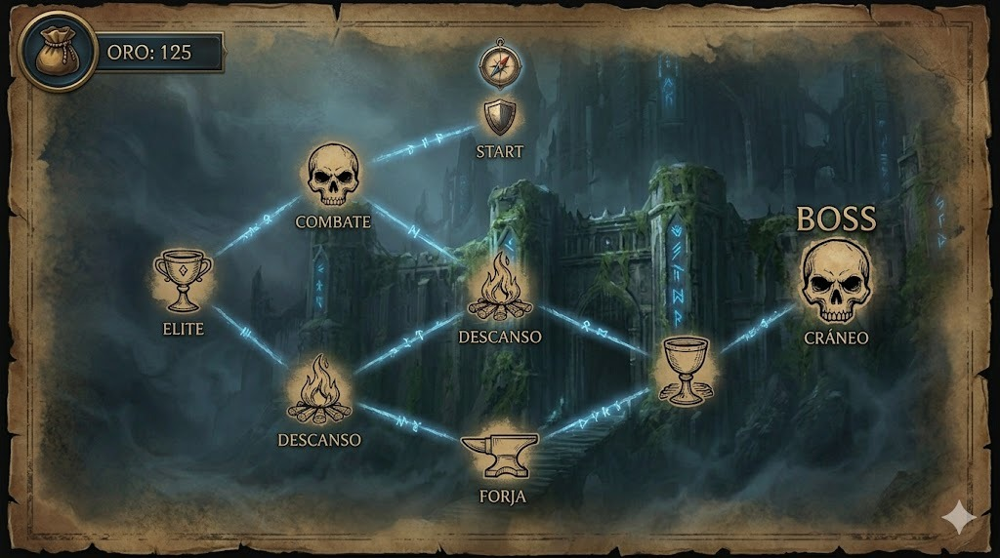
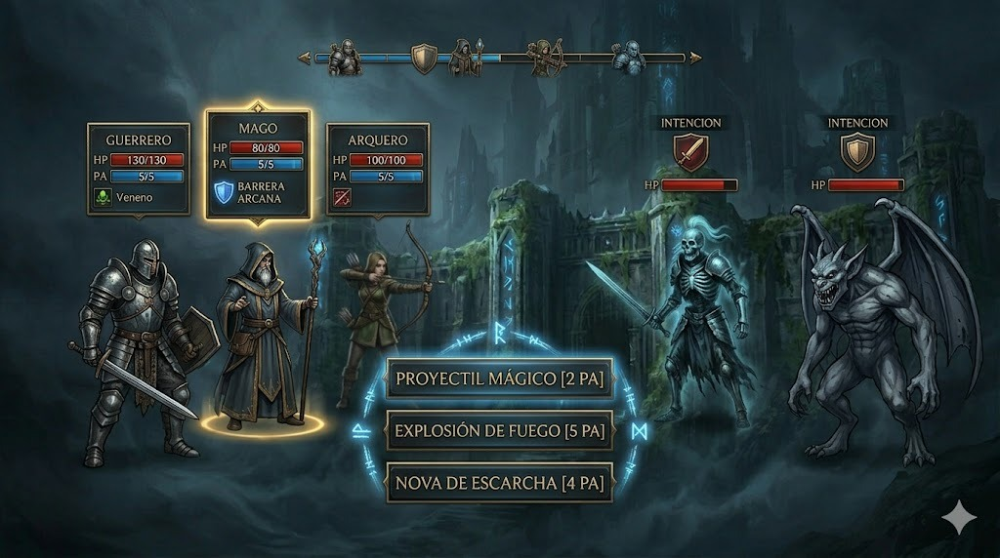

# ⚔️ Oathbreaker: The Sunken Realm

> *Trabajo Práctico: Paradigma Orientado a Objetos (Fase A)*
> Un RPG táctico por turnos donde la estrategia y la gestión de recursos son la clave para la supervivencia.

---

## 📜 Sobre el Proyecto

*Oathbreaker: The Sunken Realm* es un videojuego de rol (RPG) por turnos diseñado íntegramente bajo los principios del Paradigma Orientado a Objetos. Inspirado en la profundidad táctica de los combates de Dungeons & Dragons y la estética de Expedition 33, el juego se centra en un sistema de encuentros de combate sucesivos, exigentes y altamente estratégicos.

El jugador toma el mando de una party personalizable de entre 2 y 4 héroes, debiendo equilibrar sus habilidades, equipamiento y sinergias para superar las distintas amenazas del reino hundido.

---

## ⚙️ Mecánicas Principales

A diferencia de los RPGs tradicionales, el núcleo de Oathbreaker reside en su sistema de combate dinámico y la gestión técnica del grupo:

* *⏳ Turnos por Iniciativa (Velocidad):* El orden de acción no es fijo. Se calcula dinámicamente en base al atributo de Velocidad de cada entidad, permitiendo a los personajes más ágiles actuar múltiples veces antes que los enemigos pesados.
* *🎒 Sistema de Equipamiento Avanzado:* El inventario es crucial. Los atributos base se modifican mediante la administración de armas, armaduras y accesorios (anillos/amuletos) que impactan directamente en las estadísticas de combate. 
* *✨ Gestión de Recursos (PA/Maná):* Las habilidades especiales consumen Puntos de Acción (PA) o Maná. Administrar estos recursos a lo largo de combates consecutivos es vital para no quedar indefenso ante el jefe final.
* *📈 Progresión y Recompensas:* Derrotar enemigos otorga Experiencia (EXP) y Oro. Al subir de nivel, los personajes mejoran sus atributos, permitiendo una personalización del crecimiento del equipo.

---

## 🛡️ Clases y Arquetipos

El sistema permite formar el grupo eligiendo entre cuatro clases clásicas, cada una con responsabilidades únicas dentro del código y del combate:

1. *Guerrero:* El tanque del equipo. Alto HP y Defensa. Su rol es absorber daño y proteger a los aliados más frágiles.
2. *Mago:* Daño en área y control. Sus habilidades consumen mucho Maná, pero pueden alterar el curso de la batalla.
3. *Arquero:* Daño físico a un solo objetivo con alta letalidad y gran velocidad de iniciativa.
4. *Curador (Healer):* Indispensable para la supervivencia. Restaura HP y elimina estados alterados del grupo.

---

## 🏗️ Arquitectura y Documentación Técnica

El diseño del sistema está documentado mediante diagramas que detallan la lógica de los objetos y sus interacciones. Estos se encuentran disponibles en formato de texto plano para su visualización en herramientas de modelado:

* *Diagrama de Clases:* Describe la jerarquía de herencia entre la clase base Entidad y sus derivaciones, además de la estructura del sistema de ítems.
  * Archivo: docs/diagrama_clases.txt
* *Diagramas de Secuencia:* Detallan los flujos dinámicos del motor.
  * *Lógica de Combate:* Resolución de turnos y cálculo de daño. (Archivo: docs/diagramaSecuenciaCombate.txt)
  * *Navegación:* Transición entre pantallas y estados del juego. (Archivo: docs/diagramaSecuenciaMapa.txt)

---

## 🖼️ Interfaz Visual (Prototipos)

El juego cuenta con un diseño de interfaz modular, pensado para mostrar toda la información táctica de manera clara. A continuación se presentan los mockups de las vistas implementadas:

### 1. Menú Principal
Punto de inicio del juego con acceso a nuevas partidas y gestión de configuración.


### 2. Mapa de Encuentros
Muestra las rutas disponibles y los próximos nodos de combate o descanso.


### 3. Sistema de Combate
Interfaz principal donde se visualizan las barras de vida, maná y el orden de los turnos.


### 4. Resultados Post-Combate
Resumen de botín adquirido (Oro, Ítems) y experiencia ganada tras la victoria.


---

## 📁 Estructura del Repositorio

```text
.
├── Imagenes/           # Mockups y capturas de interfaz (.jpeg)
├── docs/               # Diagramas UML en formato texto (.txt)
├── src/
│   ├── model/          # Lógica de negocio y entidades
│   ├── controller/     # Controladores de turnos e inventario
│   ├── view/           # Vistas y componentes UI
│   └── persistence/    # Sistema de guardado
└── README.md